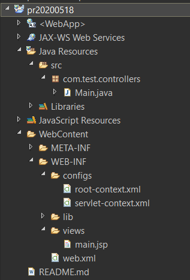

## Created on 2020/05/18

- Spring version: 3.2

- Server: IBM Liberty Server<br>
Product name: WebSphere Application Server<br>
Product version: 18.0.0.4<br>
Product edition: BASE_ILAN<br>
( Views: Servers > Liberty Server at localhost > right click > properties )<br>
[Administering Liberty using Admin Center](https://www.ibm.com/support/knowledgecenter/SSEQTP_liberty/com.ibm.websphere.wlp.doc/ae/twlp_ui.html)<br>
[Admin Center](https://developer.ibm.com/wasdev/downloads/#asset/features-com.ibm.websphere.appserver.adminCenter-1.0)<br>
Directory: C:\wlp

### Snapshot


### Google drive back up
[Link](https://drive.google.com/open?id=1xYbkQpUhBNEEJVqt6r3sNfygVdbaPbic)

### Jars on 2020/05/18:
- aopalliance-1.0.jar
- commons-logging-1.1.1.jar
- spring-aop-3.2.18.RELEASE.jar
- spring-beans-3.2.18.RELEASE.jar
- spring-context-3.2.18.RELEASE.jar
- spring-context-support-3.2.18.RELEASE.jar
- spring-core-3.2.18.RELEASE.jar
- spring-expression-3.2.18.RELEASE.jar
- spring-security-acl-3.2.10.RELEASE.jar
- spring-security-config-3.2.10.RELEASE.jar
- spring-security-core-3.2.10.RELEASE.jar
- spring-security-taglibs-3.2.10.RELEASE.jar
- spring-security-web-3.2.10.RELEASE.jar
- spring-tx-3.2.18.RELEASE.jar
- spring-web-3.2.18.RELEASE.jar
- spring-webmvc-3.2.18.RELEASE.jar

### web.xml
```xml
<?xml version="1.0" encoding="UTF-8"?>
<web-app version="3.0" xmlns="http://java.sun.com/xml/ns/javaee"
	xmlns:xsi="http://www.w3.org/2001/XMLSchema-instance"
	xsi:schemaLocation="http://java.sun.com/xml/ns/javaee http://java.sun.com/xml/ns/javaee/web-app_3_0.xsd">

<!-- context-param -->
	<!-- The definition of the Root Spring Container shared by all Servlets and Filters -->
	<context-param>
		<param-name>contextConfigLocation</param-name>
		<param-value>
		    /WEB-INF/configs/root-context.xml
		</param-value>
	</context-param>
<!-- context-param -->	
	
	<!-- Creates the Spring Container shared by all Servlets and Filters -->

<!-- listener --> 
	<listener>
		<listener-class>org.springframework.web.context.ContextLoaderListener</listener-class>
	</listener>
<!-- listener --> 
	
<!-- servlet --> 
	<!-- Processes application requests -->
	<servlet>
		<servlet-name>appServlet</servlet-name>
		<servlet-class>org.springframework.web.servlet.DispatcherServlet</servlet-class>
		<init-param>
			<param-name>contextConfigLocation</param-name>
			<param-value>/WEB-INF/configs/servlet-context.xml</param-value>
		</init-param>
		<load-on-startup>1</load-on-startup>
	</servlet>		
	<servlet-mapping>
		<servlet-name>appServlet</servlet-name>
		<url-pattern>/</url-pattern>
	</servlet-mapping>
<!-- servlet --> 

<!-- filter --> 	
	<!-- encodingFilter start -->	
	<filter>  
	    <filter-name>encodingFilter</filter-name>  
	    <filter-class>org.springframework.web.filter.CharacterEncodingFilter</filter-class>  
	    <init-param>  
	       <param-name>encoding</param-name>  
	       <param-value>UTF-8</param-value>  
	    </init-param>  
	    <init-param>  
	       <param-name>forceEncoding</param-name>  
	       <param-value>true</param-value>  
	    </init-param>  
	</filter>  
	<filter-mapping>  
	    <filter-name>encodingFilter</filter-name>  
	    <url-pattern>/*</url-pattern>  
	</filter-mapping> 
	<!-- encodingFilter end -->	
<!-- filter --> 
</web-app>
```

### root-context.xml / app-context.xml
```xml
<?xml version="1.0" encoding="UTF-8"?>
<beans xmlns="http://www.springframework.org/schema/beans"
	xmlns:xsi="http://www.w3.org/2001/XMLSchema-instance"
	xmlns:tx="http://www.springframework.org/schema/tx"
	xmlns:context="http://www.springframework.org/schema/context"
	xmlns:p="http://www.springframework.org/schema/p"
	xmlns:jpa="http://www.springframework.org/schema/data/jpa"
	xsi:schemaLocation="http://www.springframework.org/schema/beans 
						http://www.springframework.org/schema/beans/spring-beans.xsd
		http://www.springframework.org/schema/data/jpa http://www.springframework.org/schema/data/jpa/spring-jpa-3.2.xsd
		http://www.springframework.org/schema/tx 
		http://www.springframework.org/schema/tx/spring-tx-3.2.xsd
		http://www.springframework.org/schema/context 
		http://www.springframework.org/schema/context/spring-context-3.2.xsd">
		
	<!-- Root Context: defines shared resources visible to all other web components -->
	<tx:annotation-driven/>
</beans>
```

### servlet-context.xml / web-context
```xml
<?xml version="1.0" encoding="UTF-8"?>
<beans xmlns="http://www.springframework.org/schema/beans" 
    xmlns:mvc="http://www.springframework.org/schema/mvc"
	xmlns:xsi="http://www.w3.org/2001/XMLSchema-instance"
	xmlns:context="http://www.springframework.org/schema/context"
	xsi:schemaLocation="http://www.springframework.org/schema/mvc http://www.springframework.org/schema/mvc/spring-mvc-3.2.xsd
		http://www.springframework.org/schema/beans http://www.springframework.org/schema/beans/spring-beans-3.2.xsd
		http://www.springframework.org/schema/context http://www.springframework.org/schema/context/spring-context-3.2.xsd">

	<!-- DispatcherServlet Context: defines this servlet's request-processing infrastructure -->
	
	<!-- Enables the Spring MVC @Controller programming model -->
	<mvc:annotation-driven />

	<!-- Handles HTTP GET requests for /resources/** by efficiently serving up static resources in the ${webappRoot}/resources directory -->
	<mvc:resources mapping="/resources/**" location="/resources/" />

	<!-- Resolves views selected for rendering by @Controllers to .jsp resources in the /WEB-INF/views directory -->
	<bean class="org.springframework.web.servlet.view.InternalResourceViewResolver">
		<property name="prefix" value="/WEB-INF/views/" />
		<property name="suffix" value=".jsp" />
	</bean>
	
	<context:component-scan base-package="com.test" />
</beans>
```